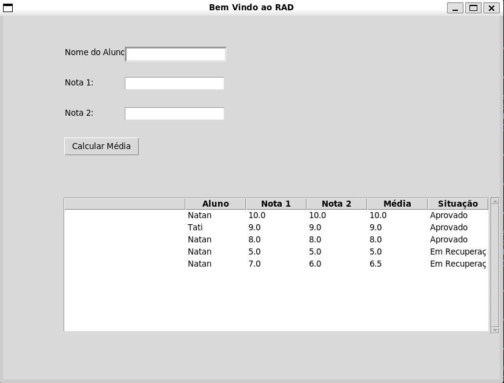

<h3 align="center">Python project with database and GUI</h3>

<div align="center">

[](https://www.python.org/)
[]()

</div>

---

## 📝 Table of Contents

- [📝 Table of Contents](#-table-of-contents)
- [🏁 Getting Started ](#-getting-started-)
  - [Prerequisites](#prerequisites)
  - [Installing](#installing)
- [🎈 Usage ](#-usage-)
- [View Project](#view-project)
- [⛏️ Built With ](#️-built-with-)
- [✍️ Authors ](#️-authors-)


## 🏁 Getting Started <a name = "getting_started"></a>

### Prerequisites


Python installed in version 3.12.3

```bash
# python --version
Python 3.12.3
```

### Installing


Installing the libraries from the "requirements.txt" file

```bash
pip install -r requirements.txt
```

## 🎈 Usage <a name="usage"></a>

Start Project

```bash
python main.py

```

## View Project



## ⛏️ Built With <a name = "tech_stack"></a>

- [Python](https://www.python.org/) - Server Environment
- [Tkinter](https://tkdocs.com/index.html) -
GUI framework
- [Pandas](https://pandas.pydata.org/) - Data Base in excel.
- [RAD](https://pt.wikipedia.org/wiki/Desenvolvimento_r%C3%A1pido_de_aplica%C3%A7%C3%B5es) - Applied methodology

## ✍️ Authors <a name = "authors"></a>

- [College Estacio](https://estudante.estacio.br/) - Idea & Initial work
